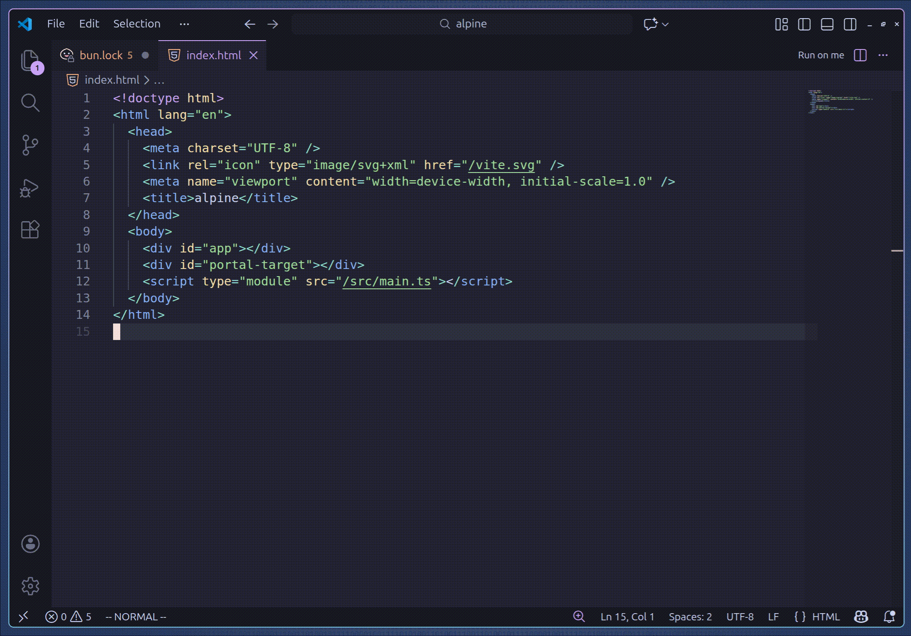

# Run On Me - VSCode Extension

## Brief Description
The "vscode-run-on-me" extension allows you to run code snippets directly from your editor with ease. Simply select the code you want to execute and trigger the command to see the results instantly.

## Configuration

To create commands to be executed search for "RunOnMe Settings" in the explorer (Ctrl+Shift+P).
Set your command name and content. Use `${ME}` to represent current file path.

In order to run command, open any file and use RunOnMe button in the top right corner of the editor (or in Run dropdown menu if you have other run-related actions).
Alternatively, you can assign a keyboard shortcut through VSCode keyboard shortcuts settings.

After executing the command, the output will be displayed in the "RunOnMe Output" Infomation Message, allowing you to choose from the commands you have configured.

## Example Configuration and Usage

## Release Notes

### 0.0.1

Initial release of the "vscode-run-on-me" extension.

### 0.0.2
Changed the display name for easier search on marketplace.

**Enjoy!**
